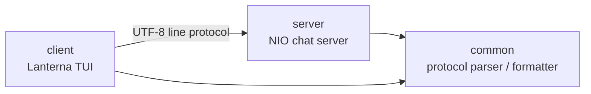
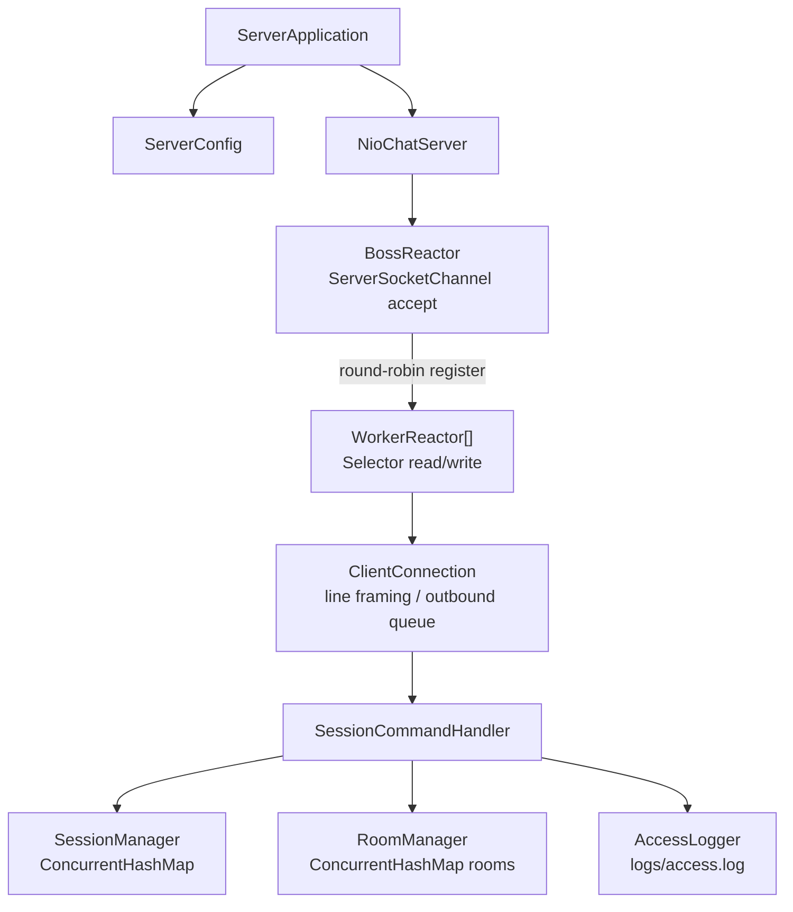
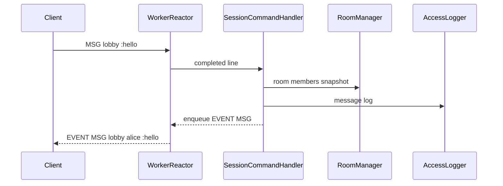

# adv-java-chatroom

Java NIO로 만든 멀티룸 채팅 서버와 Lanterna 기반 터미널 클라이언트입니다. 서버는 여러 클라이언트를 동시에 받으며 로그인, 채팅방 생성과 입장, 퇴장, 방 메시지, 귓속말, 접속자/방 목록 조회를 처리합니다. 접속과 주요 명령은 파일 로그로 남깁니다.

프로토콜은 UTF-8 줄 단위 텍스트입니다. 클라이언트는 한 줄을 보내고, 서버는 `OK`, `ERR`, `EVENT` 형식으로 응답합니다.

## 모듈 구성

- `common`: 프로토콜 모델, 파서, 포매터, 검증 규칙
- `server`: NIO 멀티 리액터 서버, 세션, 방 관리, 로그, 명령 처리
- `client`: Lanterna TUI 클라이언트



## 서버 내부 구조

서버는 accept와 read/write 처리를 분리합니다. boss 리액터는 새 소켓을 받고, worker 리액터는 각 클라이언트 채널의 읽기와 쓰기를 맡습니다. 명령 파싱 이후의 세션/방 상태 변경은 business worker pool에서 처리합니다.



메시지 흐름은 다음과 같습니다.



## 실행 방법

전체 테스트:

```sh
./gradlew test
```

서버 실행:

```sh
./gradlew :server:run
```

옵션을 지정할 수도 있습니다.

```sh
./gradlew :server:run --args="--port 5000 --reactor-threads 4 --business-threads 32 --max-clients 1024 --queue-capacity 100 --idle-timeout-seconds 600 --log-file logs/access.log"
```

서버 옵션:

- `--port`: listen 포트. 기본값은 `5000`입니다. 테스트에서는 `0`으로 임시 포트를 쓸 수 있습니다.
- `--reactor-threads`: worker selector 스레드 수. 기본값은 사용 가능한 프로세서 수입니다.
- `--business-threads`: 명령 처리용 고정 스레드 풀 크기. 기본값은 `32`입니다.
- `--max-clients`: 동시 접속 수 제한. 기본값은 `1024`입니다.
- `--queue-capacity`: 연결별 입력 backlog와 출력 큐 크기. 기본값은 `100`입니다.
- `--idle-timeout-seconds`: 유휴 연결 종료 시간. 기본값은 `600`입니다.
- `--log-file`: 접속 로그 파일 경로. 기본값은 `logs/access.log`입니다.

클라이언트 실행:

```sh
./gradlew :client:run
```

옵션:

```sh
./gradlew :client:run --args="--host 127.0.0.1 --port 5000"
```

클라이언트 옵션:

- `--host`: 서버 호스트. 기본값은 `127.0.0.1`입니다.
- `--port`: 서버 포트. 기본값은 `5000`입니다.

TUI에서는 프로토콜 명령을 그대로 입력합니다. Enter를 누르면 현재 줄을 서버로 보냅니다. `Esc`, `Ctrl-Q`, `Ctrl-C`는 종료 단축키이며, 연결이 살아 있으면 먼저 `QUIT`을 보냅니다.

## 프로토콜

모든 메시지는 UTF-8 한 줄입니다. 요청과 응답은 `\n`으로 끝나며, 서버는 `\r\n`도 처리합니다.

요청:

```text
LOGIN <username>
ROOM CREATE <room>
ROOM JOIN <room>
ROOM LEAVE <room>
MSG <room> :<message>
WHISPER <username> :<message>
LIST USERS
LIST ROOMS
QUIT
```

서버 출력:

```text
OK <request tokens> [arguments...]
ERR <code> :<message>
EVENT <type> [arguments...] [:trailing text]
```

이벤트:

```text
EVENT ROOM_CREATE <room> <username>
EVENT ROOM_JOIN <room> <username>
EVENT ROOM_LEAVE <room> <username>
EVENT MSG <room> <username> :<message>
EVENT WHISPER <username> :<message>
EVENT SERVER_SHUTDOWN :server is shutting down
```

오류 코드:

- `400 MALFORMED_COMMAND`: 알 수 없는 명령, 인자 수 오류, 잘못된 토큰, 잘못된 식별자, 잘못된 UTF-8
- `401 LOGIN_REQUIRED`: 로그인이 필요한 명령
- `404 NOT_FOUND`: 사용자 또는 방을 찾을 수 없음
- `409 INVALID_STATE`: 중복 사용자명, 이미 로그인된 연결, 이미 있는 방, 방 멤버가 아닌 상태
- `413 TOO_LONG`: 줄 또는 메시지 본문 길이 초과. 서버는 오류를 보낸 뒤 연결을 닫습니다.
- `429 CAPACITY_EXCEEDED`: 입력 backlog, 출력 큐, 서버 접속 수 제한 초과
- `500 INTERNAL_ERROR`: 서버 내부 오류

제한:

- 한 줄 최대 길이: Unicode code point 기준 `1024`
- 메시지 본문 최대 길이: Unicode code point 기준 `512`
- 사용자명과 방 이름: `1..20`자, `[A-Za-z0-9_-]`
- 프로토콜 토큰에는 공백을 넣을 수 없고, 토큰은 `:`로 시작할 수 없습니다.
- 이벤트 타입: `1..32`자, `[A-Z0-9_]`

예시:

```text
LOGIN alice
OK LOGIN alice
ROOM CREATE lobby
OK ROOM CREATE lobby
EVENT ROOM_CREATE lobby alice
ROOM JOIN lobby
OK ROOM JOIN lobby
MSG lobby :hello everyone
EVENT MSG lobby alice :hello everyone
LIST USERS
OK LIST USERS alice bob
WHISPER bob :private hello
OK WHISPER bob
QUIT
OK QUIT
```

## 동시성과 자원 정리

세션은 사용자명과 연결 기준으로 `ConcurrentHashMap`에 저장합니다. 로그인은 `putIfAbsent`로 처리해 같은 사용자명이 동시에 등록되지 않게 했습니다. 세션은 활성/비활성 상태를 갖고, 연결 종료와 명령 처리가 겹쳐도 이미 닫힌 세션이 방에 다시 들어가지 않도록 보호합니다.

방은 `RoomManager`가 관리합니다. 방 목록은 `ConcurrentHashMap`에 저장하고, 방 멤버는 concurrent set으로 둡니다. 사용자는 여러 방에 들어갈 수 있습니다. 마지막 멤버가 나간 방은 자동으로 삭제됩니다.

연결별 출력 큐와 입력 backlog는 `--queue-capacity`로 제한합니다. 큐가 가득 차면 서버는 가능한 경우 `ERR 429`를 보낸 뒤 연결을 닫습니다. 너무 긴 줄은 `ERR 413`을 보낸 뒤 닫습니다.

서버 종료 시에는 각 연결에 `EVENT SERVER_SHUTDOWN :server is shutting down`을 보내고 소켓과 selector, worker pool, 로그 파일을 정리합니다. 이미 끊겼거나 쓰기 불가능한 소켓에는 이벤트가 전달되지 않을 수 있습니다.

## 접속 로그

기본 로그 파일은 `logs/access.log`입니다. 부모 디렉터리가 없으면 서버가 생성합니다.

로그에는 다음 항목이 남습니다.

- 서버 시작과 종료
- 접속 accept, 접속 거부, 원격 종료, timeout
- 로그인 성공, 실패, 중복 사용자명
- 방 생성, 입장, 퇴장
- 일반 메시지와 귓속말 본문
- `QUIT`, 길이 초과, 큐 포화, reactor failure, 예상하지 못한 예외

과제 검증을 쉽게 하려고 메시지 본문도 로그에 남깁니다. 실제 운영 환경이라면 일반 메시지와 귓속말 본문은 저장하지 않거나 별도 정책을 두는 편이 안전합니다.

로그 확인:

```sh
tail -f logs/access.log
```

## 테스트

전체 테스트:

```sh
./gradlew test
```

모듈별 테스트:

```sh
./gradlew :common:test
./gradlew :server:test
./gradlew :client:test
```

수동 확인은 터미널 3개로 진행하면 됩니다.

1. 서버 실행

   ```sh
   ./gradlew :server:run --args="--port 5000 --log-file logs/access.log"
   ```

2. 클라이언트 2개 실행

   ```sh
   ./gradlew :client:run --args="--host 127.0.0.1 --port 5000"
   ```

3. 첫 번째 클라이언트

   ```text
   LOGIN alice
   ROOM CREATE lobby
   MSG lobby :hello from alice
   LIST USERS
   LIST ROOMS
   ```

4. 두 번째 클라이언트

   ```text
   LOGIN bob
   ROOM JOIN lobby
   MSG lobby :hi alice
   WHISPER alice :private hello
   QUIT
   ```

확인할 내용은 네 가지입니다. 같은 방의 클라이언트에게만 `EVENT MSG`가 전달되는지, 귓속말이 대상에게만 가는지, `LIST USERS`와 `LIST ROOMS`가 맞는지, `logs/access.log`에 접속과 명령 기록이 남는지 보면 됩니다.

## 구현하지 않은 항목

- TLS
- JSON 프로토콜
- 인증 토큰
- 메시지 저장과 재전송
- 외부 로드밸런서를 둔 다중 프로세스 HA
- Lanterna fullscreen UI 자동 테스트
